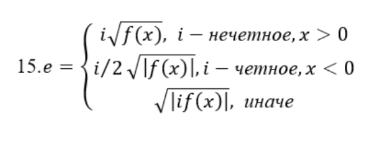
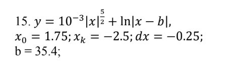

# ИСИП323 Эрдынеева Суранзан
## МДК.01.02 Поддержка и тестирование программных модулей
----------------
### ПРАКТИЧЕСКАЯ РАБОТА No4 ТЕСТИРОВАНИЕ "БЕЛЫМ ЯЩИКОМ" - Часть 1
- Цель работы: приобрести практические навыки ручного тестирования
методом "белого ящика".
- Разработчик: студентка группы ИСИП-323 Эрдынеева С.Б.
- Разработанное ПО: WPF-приложение
- Вариант: 15
  1. 
  2. 
  3. 
- Используемые инструменты: OxyPlot (2.2.0)
- Архитектура: приложение имеет три отдельных окна, между которыми можно переключаться с помощью кнопок "Back" и "Next". Все взамодействующие элементы имеют ToolTip-подсказки. Структура интерфейса строится на Grid и не является адаптивной. 
